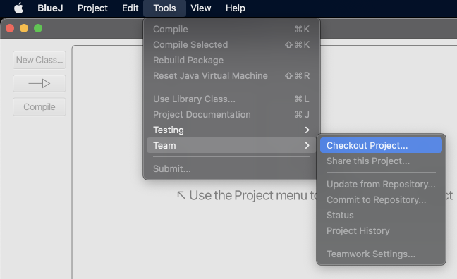
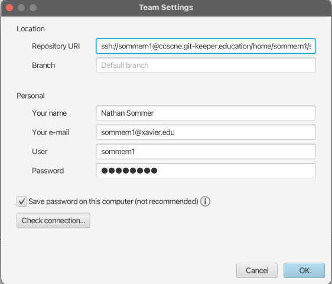
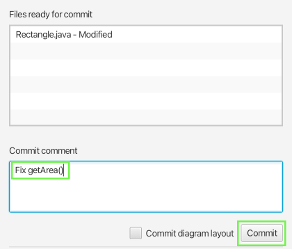

## Git-keeper Student Workflow

The workflow for most git-keeper assignments is:

1. Receive an email with a clone URL for a Git repository on the server
2. Clone the repository using the URL from the email
3. Do your work in the local clone of the repository
4. Add and commit your changes to the local repository
5. Push your changes back to the server
6. Check your email to make sure the submission was received and see the results of any tests that were run. If the tests did not pass, you can go back to step 3 and submit again.

## Example: Simple BlueJ Assignment

BlueJ is a Java IDE aimed at introductory programming. We chose BlueJ as the platform for this tutorial because it has Git support built in, and illustrates how git-keeper can be used even at the introductory course level. If you wish to try out the sample assignments but do not have BlueJ installed, download version 5.2.1 since the latest version seems to have broken Git support: [https://www.bluej.org/versions.html](https://www.bluej.org/versions.html)

If you have not done so already, fill out the form at [https://ccscne.git-keeper.education/](https://ccscne.git-keeper.education/) to be added to the sample course.

### Git-keeper Emails

You will receive two emails from `gitkeeper@moravian.edu`: one containing account information and another containing information about a sample assignment. Check your spam folder if you do not see these in your inbox. The assignment emails should contain a link to these instructions.

### Cloning 

BlueJ has built-in support for cloning Git repositories. Open BlueJ and click Tools -> Team -> Checkout Project, like so:



Copy the clone URL from the `bluej1-rectangle` assignment email and paste it in the Team Settings window that appears. Leave the branch field as it is. Fill in the rest of your information, using the password from the account email you received from git-keeper. Saving your password should be okay since it is randomly generated:



Press the "Check connection..." button. If you see an error about an unknown protocol, check to see if there are extra spaces at the beginning of the "Repository URI" field.

Click OK. You will the be prompted to choose a name and location for the repository on your machine. Use "bluej1-rectangle" as the name, and choose a suitable location:


If the project repository is cloned successfully, you should see this:


### Editing a Solution

Double click on the striped orange box labeled "Rectangle", which will open up an editor for the `Rectangle` class. The class has `height` and `width` fields with getters, and a `getArea()` method that is currently a stub that returns 0.

Go to the `getArea()` method at the bottom of the class, and edit it to  have a *partially correct* solution:


You can close the class and click the "Compile" button to ensure your code compiles, which should remove the stripes on the rectangle. To test the class, create an object using the class's context menu:


Enter positive values for width and height:


When you click OK, there should now be a red box in the bottom pane for your object. Run the `getArea()` method using this box's context menu:


Confirm that the return value is as expected.

### Submitting a Solution

To submit this solution, first expand the Teamwork pane using the triangle icon above the object box (highlighted in green below):


Click the "Commit/Push" button:


Enter a commit message and click "Commit":



Click the "Push" button to submit:


That's it! You should now receive an email from git-keeper with your test results. Since this solution did not take into account the desired behavior with negativie width/height, one test fails. You should see the following:

```
Compiling your code...
Success!

Compiling your code with my tests...
Success!

Below is the output from testing your code.
╷
├─ JUnit Jupiter ✔
│  └─ RectangleTest ✔
│     ├─ testGetWidth() ✔
│     ├─ testGetArea() ✔
│     ├─ testGetHeight() ✔
│     └─ testGetAreaNegative() ✘ Expected getArea() to return 0 when width is 1 and height is -2. Instead getArea() returned -2
└─ JUnit Vintage ✔

...
```

Fix the method with a proper solution:


You can now repeat the steps to compile, create an object and run `getArea()`, commit, and push. After another push you should see an email that all the tests have passed:

```
Compiling your code...
Success!

Compiling your code with my tests...
Success!

Below is the output from testing your code.
╷
├─ JUnit Jupiter ✔
│  └─ RectangleTest ✔
│     ├─ testGetWidth() ✔
│     ├─ testGetArea() ✔
│     ├─ testGetHeight() ✔
│     └─ testGetAreaNegative() ✔
└─ JUnit Vintage ✔

...
```
